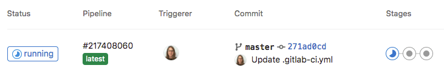

<p align="center">
  <a href="" rel="noopener">
 </a>
</p>

<h1 align="center">Criando um repositório no GitLab e um pipeline que execute um "echo Hello World"</h1> 
<p align="center"><i>Criando e executando uma simples pipeline de CI/CD no GitLab</i></p>

## 📑 Requisitos

- Ter uma conta no GitLab.

## 📝 Tabela de conteúdos
- [Criando arquivo YAML que especifica instruções para GitLab CI/CD (Passo 1)](#step1)
- [Referências](#documentation)

## ⚙️ Criando arquivo YAML que especifica instruções para GitLab CI/CD (Passo 1)<a name = "step1"></a>

1. Antes de qualquer coisa, certifique-se de ter "runners" disponíveis.
    
    - No GitLab, "runners" são agentes que executam seus trabalhos de CI/CD.

- Para visualizar os corredores disponíveis:

    - Vá para **Configurações > CI/CD** e expanda "Runners".

    - Caso não tenha "runners", siga essa documentação: [Como instalar GitLab Runner](https://docs.gitlab.com/runner/install/)

- Crie um repositório no GitLab.

2. Criando um arquivo YAML com instruções para o pipeline.

- A partir desse arquivo podemos definir:
    - A estrutura e a ordem dos trabalhos que o "runner" (máquina) deve executar.
    - As decisões que o "runner" deve tomar quando condições específicas são encontradas.

- Ao entrar no repositório, na barra lateral esquerda, selecione **Código > Repositório**

- Selecione a branch, em seguida selecione o ícone de adição (+) e crie um novo arquivo:

    

<br>

- Para "filename", digite ".gitlab-ci.yml" e depois copie essas instruções:

    ```yaml
    build-job:
      stage: build
      script:
        - echo "Hello, $GITLAB_USER_LOGIN!"
    
    test-job1:
      stage: test
      script:
        - echo "This job tests something"
    
    test-job2:
      stage: test
      script:
        - echo "This job tests something, but takes more time than test-job1."
        - echo "After the echo commands complete, it runs the sleep command for 20 seconds"
        - echo "which simulates a test that runs 20 seconds longer than test-job1"
        - sleep 20
    
    deploy-prod:
      stage: deploy
      script:
        - echo "This job deploys something from the $CI_COMMIT_BRANCH branch."
      environment: production
    ```

    - Nessas instruções temos quatro trabalhos: build-job, test-job1, test-job2 e deploy-prod.

3. Selecione "Commit changes"

- O pipeline começa e executa os trabalhos (jobs) que você definiu no arquivo ".gitlab-ci.yml".

## ⚙️ Veja o status de sua pipeline e trabalhos (jobs)<a name = "step2"></a>

1. Vá para **Build > Pipelines**

- Um pipeline com 3 estágios deve ser mostrada.

    

<br>

- Veja a representação visual do pipeline selecionando o ID do pipeline:

    

<br>

- Visualize os detalhes de um trabalho selecionando o nome do trabalho. Por exemplo, **deploy-prod**:

    

### - Pipeline de CI/CD no gitlab criada com sucesso!

<br>

## Referências utilizadas:<a name="documentation"></a>

- [Documentação do GitLab - Quickstart](https://docs.gitlab.com/ee/ci/quick_start/)
